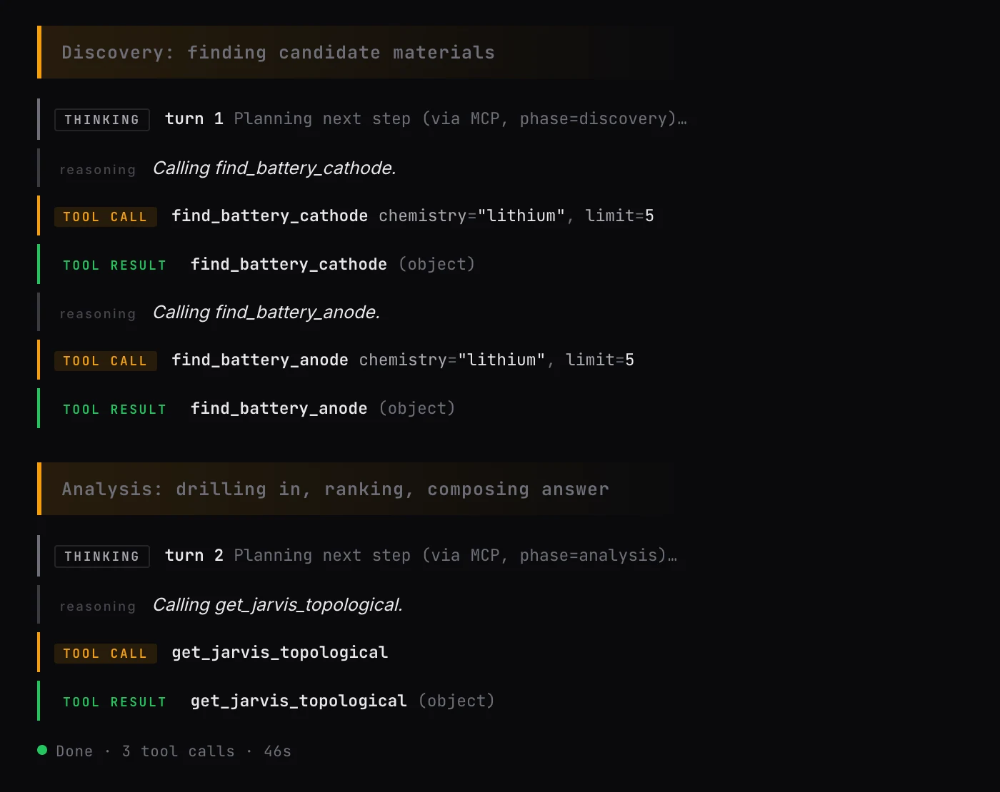
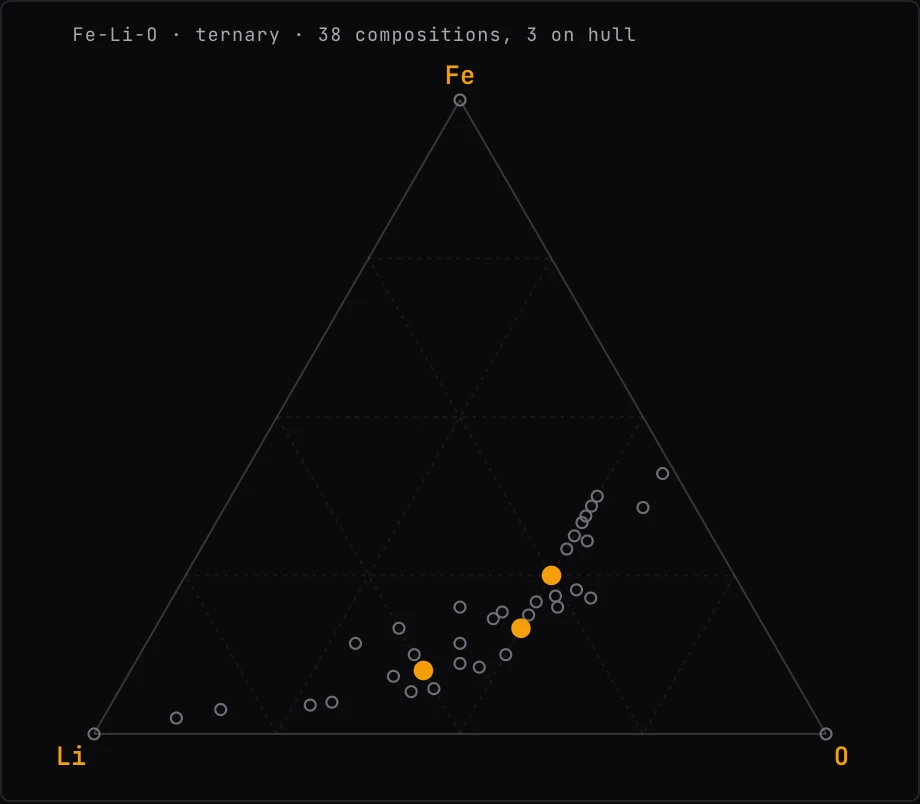
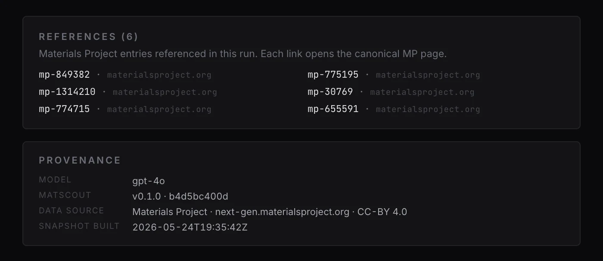
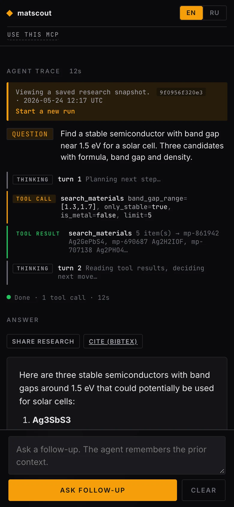

# matscout

An MCP server with 25 typed tools over Materials Project, 5 more crystal databases and 4 literature and reference sources, plus a web agent that calls it.

Personal project, built for a university course paper in materials science.

matscout turns a plain-language materials question into database queries, stability checks and a ranked shortlist with Materials Project ids and citations. It is for materials researchers who want these lookups inside Claude or another MCP client, and for engineers who want a working example of an agent that reasons through its own public MCP server.


## Live

- Web app: https://matscout.prfo.design
- MCP endpoint (Streamable HTTP): https://matscout.prfo.design/mcp/http/

Connect Claude Code:

```bash
claude mcp add --transport http matscout https://matscout.prfo.design/mcp/http/
claude mcp list   # expect a matscout line
# then ask Claude: "List the tools you got from matscout." Expect 25 names.
```

The remote endpoint needs no key on your side. Claude Desktop, a local stdio setup and a smoke test are in [docs/mcp-setup.md](docs/mcp-setup.md).

## Key technical decisions

### One tool list, three transports

`ALL_TOOLS` in `matscout/tool_facades.py` is the only registry. `mcp_server.py` registers it in one loop (`for _fn in ALL_TOOLS: mcp.tool()(_fn)`). The function name is the tool name and the docstring is the description. One FastMCP instance serves stdio (`matscout-mcp`), Streamable HTTP (`/mcp/http/`) and SSE (`/mcp/sse/`), so no surface keeps its own schemas.

| Group | Tools |
|---|---|
| Property lookup (4) | `search_materials`, `get_material`, `compare_materials`, `check_stability` |
| Synthesis (4) | `get_phase_diagram`, `predict_decomposition`, `get_competing_phases`, `compute_phase_diagram_strict` |
| Application finders (5) | `find_battery_anode`, `find_battery_cathode`, `find_solar_absorber`, `find_thermoelectric`, `find_transparent_conductor` |
| Property sheets (2) | `get_elastic_properties`, `get_electronic_summary` |
| Ranking (1) | `pareto_rank` |
| Structure export (1) | `get_structure` (CIF, POSCAR, XYZ) |
| JARVIS (2) | `find_2d_materials`, `get_jarvis_topological` |
| OPTIMADE (1) | `optimade_search` over 6 providers: MP, COD, NOMAD, Alexandria, JARVIS, odbx |
| COD (1) | `find_cod_experimental` |
| Literature and reference (4) | `get_doi_metadata` (Crossref), `find_preprints` (arXiv), `search_openalex`, `get_wikipedia_summary` |

### The agent calls its own MCP server over the network

The web agent does not use in-process function calling. `agent/runner.py` gives the OpenAI Responses API (gpt-4o) a single tool, `{type: "mcp", server_url, allowed_tools, require_approval: "never"}`. OpenAI lists the tools and calls `https://matscout.prfo.design/mcp/http/` over HTTPS, so every web query goes through the same endpoint that external MCP clients use. Browser to server is short polling, not a stream: some networks cut long-lived `text/event-stream` responses.

```
browser --POST /api/query--> web/app.py --> agent/runner.py --> OpenAI Responses API (gpt-4o)
   ^                                                                 |
   |  GET /api/query/{id}?since=N every 500 ms                       |  HTTPS, MCP tools/call
   +---- trace events <-- in-memory run buffer                       v
                                                  /mcp/http/  (FastMCP, same uvicorn process)
                                                                     |
                                                  25 tools --> SQLite cache --miss--> 11 upstream endpoints
```

### Two phases, two allowlists

- Discovery gets 11 candidate-finding tools and at most 10 tool calls. Analysis gets 17 drill-in tools and at most 25 calls, chains on the Discovery response through `previous_response_id`, and writes the answer. 5 tools sit in both lists.
- The split exists because one call with every tool used to stop after 5 to 7 tool calls without writing an answer.
- The allowlists cover 23 of 25 tools. The 2 JARVIS tools are out: NIST's static dumps returned 502 and the agent kept falling back to them. JARVIS data stays reachable through `optimade_search(providers=["jarvis"])`.
- Follow-ups keep only the last OpenAI response id per conversation. Resuming a saved run rebuilds its messages and runs one phase with all 25 tools. Retry rules live in `agent/prompts.py`, not in code: widen on 0 hits and tighten above 50 in `SYSTEM_PROMPT_V1` (resumed runs); retry a wrong first hit and stop after 2-3 searches in the Discovery prompt.



*Run 9bdd31eb21a2, 2026-05-24, shown with the UI switched to EN. On 2026-05-26 `get_jarvis_topological` left the Analysis allowlist.*

### Harness: tests, eval, CI

- 75 tests. 63 run offline, need no keys, and pass in about 3 s; tool tests inject a fake MP client and cache. 12 are live (7 tool tests, 5 eval cases) and run only when `MP_API_KEY` and `OPENAI_API_KEY` are both set.
- `tests/eval/queries.yaml` holds 5 agent cases checked with 6 assertion types: tools called (any of, all of), answer text (any of, all of), minimum answer length, and a cap of 4 or 8 tool calls.
- CI on GitHub Actions has 2 jobs: lint-and-test on Python 3.11 (ruff check, ruff format --check, mypy, pytest) and a Docker build without push.
- Gaps: the repo holds no stored eval results yet, and offline tests cover 4 of 25 tools.

### Checks

- mypy in strict mode with the pydantic plugin: 33 files in `matscout/` and `web/` pass, locally and in CI; `tests/` is not type-checked.
- ruff with rule sets E, F, I, B, UP, SIM, RUF and line length 100.
- At runtime: Pydantic models with `extra="forbid"`, a FastMCP DNS-rebinding guard that answers 421 to unknown `Host` headers, a startup check that stops the web app without `OPENAI_API_KEY`, and `GET /healthz`.

### Cache and snapshots

- Tool results go to SQLite `cache/matscout.db` (WAL). Key: sha256 of the tool name plus the JSON args with sorted keys. TTL: 30 days by default (`MATSCOUT_CACHE_TTL_DAYS`, 1 to 365), checked on read; a hit does not extend it. 14 of the 25 tools read through it directly. 9 more reuse cached calls: the 5 `find_*` presets, `compare_materials`, `check_stability`, `predict_decomposition` and `find_2d_materials`. `pareto_rank` and `get_jarvis_topological` make no upstream call.
- On 2026-09-29 production held 114 entries with 291 hits; `search_materials` alone has 82 entries and 254 hits.
- Every run goes to `cache/research.db`, upserted after each trace event. `/r/{id}` (12 hex chars) replays it, `GET /api/research/{id}/citation` returns BibTeX, and each run stores 9 provenance fields: model, matscout version and commit, mp-api and openai SDK versions, build time, MP data source, license and citation.

### Deploy

- Production runs without Docker on one VPS: systemd starts uvicorn with 1 worker on `127.0.0.1:8011`, nginx proxies it, certbot handles TLS.
- `deploy.sh` writes the systemd unit and the nginx vhost, restarts the service, waits up to 30 s for `/healthz`, runs certbot and probes HTTPS. nginx and certbot must already be installed on the host. Host, user, SSH key, domain and certbot email come from the environment or a gitignored `.env.deploy`.
- 1 worker because runs and conversations live in process memory: finished runs for 600 s, idle conversations for 3600 s, at most 8 concurrent runs (429 above that).
- For local containers: `python:3.11-slim` image on port 8000, a compose file with a named cache volume, and a `/healthz` check every 30 s.

## Screens







## Stack

- Python 3.10+ (CI and Docker use 3.11), uv.
- `mcp` 1.27.1 (FastMCP), `openai` 2.38.0 (Responses API), `mp-api` 0.46.1 (0.45.13 on Python 3.10), `pymatgen` for structure export and phase diagrams.
- FastAPI 0.136.1, uvicorn 0.47.0, Pydantic 2.13.4 with pydantic-settings, httpx.
- SQLite in WAL mode for the tool cache and the run store.
- Front end: one `index.html` and one `styles.css`, vanilla JS, no build step, 3Dmol.js loaded on demand.
- Data: Materials Project, OPTIMADE (MP, COD, NOMAD, Alexandria, JARVIS, odbx), Crossref, arXiv, OpenAlex, Wikipedia. 11 upstream endpoints in total.
- Tooling: ruff, mypy, pytest, GitHub Actions, Docker.

## Run locally

### Keys

matscout ships no keys. Bring your own:

| Variable | Needed for | Get it |
|---|---|---|
| `MP_API_KEY` | Tool calls, and structure downloads (`/api/structure`) in the web app. Keep the variable defined. If it is missing, `python -m matscout` exits 1, the web app stops at startup with `ValidationError: MP_API_KEY Field required`, and the stdio MCP server starts but each tool call fails with that `ValidationError`. If it is empty, the MCP server and web app start, and each tool call fails with a 401 from Materials Project. | Free at https://next-gen.materialsproject.org/api |
| `OPENAI_API_KEY` | Web app, `matscout` CLI and live tests. The MCP server runs without it. | https://platform.openai.com/api-keys |
| `MATSCOUT_CONTACT_EMAIL` | Optional. The OpenAlex and Crossref clients add it to their User-Agent as `mailto:` (polite pool). Unset, they send no address. | Your own address |

Local runs read them from `.env` (gitignored). A stdio MCP client passes `MP_API_KEY` in its own config (`.mcp.json` is gitignored for that reason). Clients of the remote endpoint send no key. The server calls Materials Project with its own key and quota.

### Setup

```bash
git clone https://github.com/shorokhlev-sketch/matscout.git
cd matscout
uv sync --extra dev
cp .env.example .env        # fill MP_API_KEY and OPENAI_API_KEY
uv run python -m matscout   # health check: which keys are set, imports load
```

The first command after `uv sync` can take up to 1 minute while Python compiles bytecode for pymatgen and scipy. Later starts take about 5 s.

### MCP server over stdio

```bash
uv run matscout-mcp         # waits for JSON-RPC on stdin; Ctrl+C to stop
```

```bash
# prints 25, no keys needed
printf '%s\n' '{"jsonrpc":"2.0","id":1,"method":"initialize","params":{"protocolVersion":"2025-06-18","capabilities":{},"clientInfo":{"name":"cli","version":"0"}}}' '{"jsonrpc":"2.0","method":"notifications/initialized"}' '{"jsonrpc":"2.0","id":2,"method":"tools/list"}' | uv run matscout-mcp 2>/dev/null | tail -1 | python3 -c "import json,sys; print(len(json.load(sys.stdin)['result']['tools']))"
```

### Web app

```bash
uv run uvicorn web.app:app --reload --port 8011
# open http://localhost:8011
curl http://localhost:8011/healthz   # {"status":"ok"}
```

- Use port 8011 or 8090. The DNS-rebinding guard accepts only the hosts in `_ALLOWED_HOSTS` (`matscout/mcp_server.py`). On port 8000 the page loads, but the local `/mcp/http/` answers `421 Invalid Host header`.
- The web agent sends OpenAI the MCP URL from `DEFAULT_MCP_SERVER_URL` in `agent/runner.py`, which is the production endpoint, because OpenAI must reach it from the internet. A local web run therefore executes the deployed tools. To test local tool changes end to end, expose your server through a public tunnel, add its host to `_ALLOWED_HOSTS`, and set `DEFAULT_MCP_SERVER_URL` in `matscout/agent/runner.py` to the tunnel URL. The web app and CLI have no flag for it; from Python, `stream_agent(query, mcp_server_url=...)` works. Or test through stdio.

### CLI

```bash
uv run matscout "stable Li cathode, low density"
```

Needs `OPENAI_API_KEY`. Like the web app, it sends OpenAI the production MCP URL, so tools run on the deployed server. A 401 in the output means OpenAI rejected the key; the CLI then exits 1.

### Tests and checks

```bash
uv run pytest -q -m "not live"             # 63 offline tests, no keys
uv run --env-file .env pytest -q -m live   # 12 live tests; spends MP quota and OpenAI tokens
uv run ruff check . && uv run ruff format --check matscout tests
uv run mypy matscout web
```

The live tests need both keys in the process env. `uv run` does not load `.env`, so pass `--env-file .env`; without it all 12 are skipped.

### Docker

```bash
docker compose up --build    # web app on http://localhost:8000
docker compose run --rm -T mcp  # stdio MCP server in a container; -T for piped input or an MCP client
```

The container listens on 8000, so its `/mcp/http/` rejects `localhost:8000` requests (see the host note above). The web page and the stdio service work.

## Status

Live at https://matscout.prfo.design since May 2026. From 2026-05-24 to 2026-06-12 it saved 58 runs, all finished: 22.3 s and 2.36 tool calls per run on average, 21 of them through both phases.

Works: 25 tools over stdio, Streamable HTTP and SSE; the two-phase web agent with follow-ups; permalinks; BibTeX export; structure files at `GET /api/structure/{mp_id}.{cif|poscar|xyz}`; inline phase diagrams; EN and RU UI.

Known limits:

- The public MCP endpoint has no auth. nginx allows 30 requests/min per IP, burst 10, on `/mcp/`; that rule lives in the server config, not in this repo. Every call spends the server's Materials Project quota. The tools only read from upstream APIs.
- `/api/query` has no nginx limit. The app caps concurrent runs at 8.
- The eval cases need both API keys and spend OpenAI tokens, so CI does not run them and no results are stored.
- The `model` argument and `matscout --model` have no effect: every run uses gpt-4o.
- Offline tests cover `search_materials`, `get_material`, `compare_materials` and `check_stability`. The MCP server, agent runner, web app and the other 21 tools have none.
- `find_2d_materials` falls back to element-pattern search over JARVIS OPTIMADE and ignores its exfoliation-energy and band-gap filters. `get_jarvis_topological` makes no request and always returns `available: false` with 0 materials. The JARVIS OPTIMADE endpoint has no exfoliation energy or topological class.
- A restart drops in-flight runs and follow-up context. Saved runs survive.

## License

MIT, see [LICENSE](LICENSE). Materials Project data is CC-BY 4.0; cite it in downstream work. The BibTeX export includes the canonical citation.
