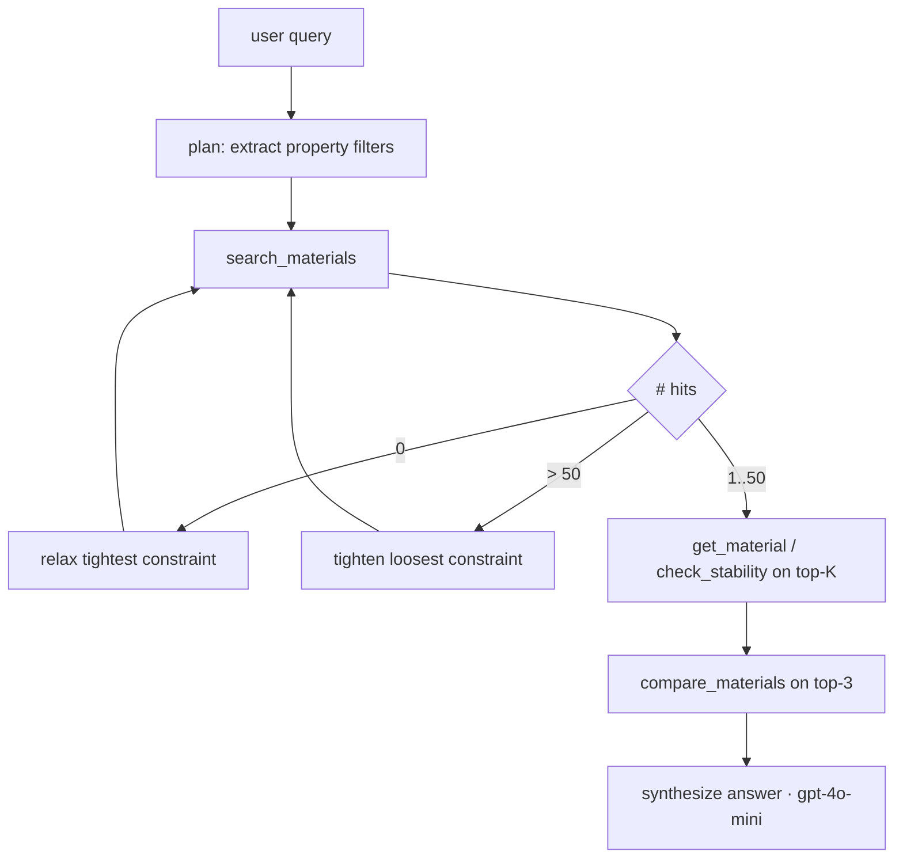

# Architecture

## Two surfaces, one set of tool functions

```mermaid
flowchart TD
    User[NL query] --> Agent[agent loop · gpt-4o]
    User2[MCP client · Claude Desktop / Code] --> MCP[mcp_server.py · FastMCP]

    Agent -->|function call| Tools{tools/* · pure Python functions}
    MCP -->|@mcp.tool| Tools

    Tools --> Cache[(SQLite cache · cache/matscout.db)]
    Cache -- miss --> MPRester[mp-api MPRester]
    MPRester --> MP[(Materials Project DB)]
    Cache -- hit --> Tools

    Tools --> Agent
    Tools --> MCP

    Agent --> Out[ranked answer + comparison table]
    MCP --> User2
```

## Why this split

- `tools/*` are dumb. They take typed args, call MPRester through the cache,
  return typed Pydantic models. **No branching by caller.** No "if mcp else
  agent". This is the only layer that touches the Materials Project API.
- `mcp_server.py` wraps the same functions as `@mcp.tool()`. Any MCP-aware
  client (Claude Desktop, Claude Code, custom) gets them with zero work on
  our side.
- `agent/runner.py` describes the same functions as OpenAI tool schemas
  (auto-generated from Python type hints). The agent loop is in charge of
  self-correction, parallelization, and synthesizing the final answer.
- `web/app.py` is a thin SSE-streaming HTTP layer over `agent/runner.py`.

## Self-correction (where the value lives)



Each relax / tighten step is logged via SSE so the playground (and the eval
suite) can show the *reasoning* alongside the result.

## Cache invariants

- Key = `sha256(tool_name + canonical_json(args))`.
- TTL = `MATSCOUT_CACHE_TTL_DAYS` (default 30).
- Cache is per-machine; never bundled with the repo. Bot does not depend
  on a populated cache to work — it just runs cold the first time.
- `compare_materials` and `check_stability` derive from already-cached
  `get_material` calls — they don't get their own cache entries.

## Failure modes

| Failure | Behaviour |
|---|---|
| MP key missing | Settings load fails at startup with a clear error. |
| MP API down | `search_materials` raises `MPUnavailableError`; agent retries once, then reports honestly. |
| 0 hits with all constraints | Agent relaxes; if still 0 after 3 relax steps, returns "no candidates, here's what I tried". |
| > 50 hits with no constraints | Agent forces `e_above_hull < 0.025`; if still > 50, returns top-50 with a note. |
| OpenAI rate limit | Exponential backoff in `agent/runner.py`. |
