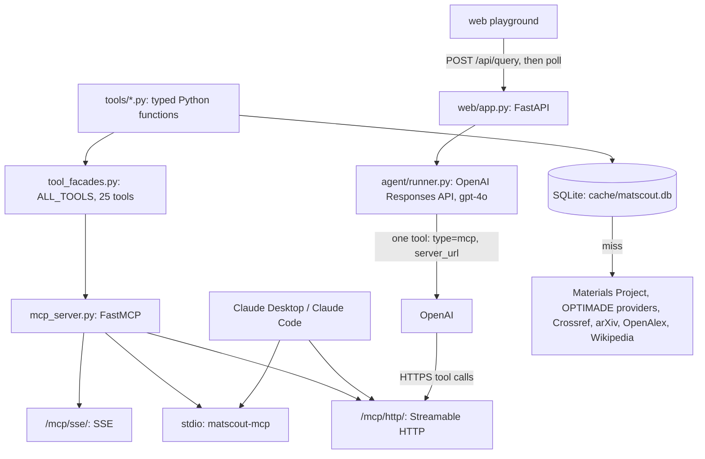
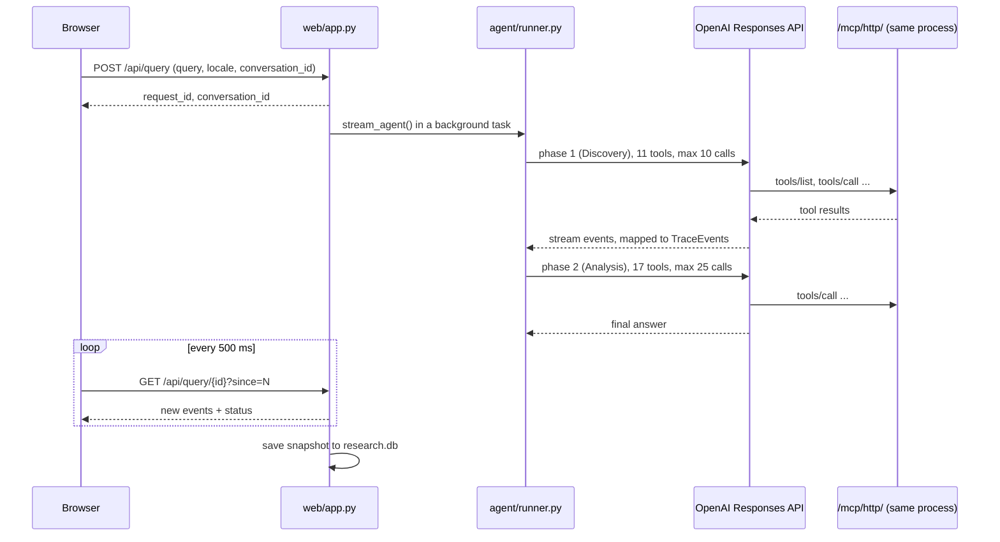
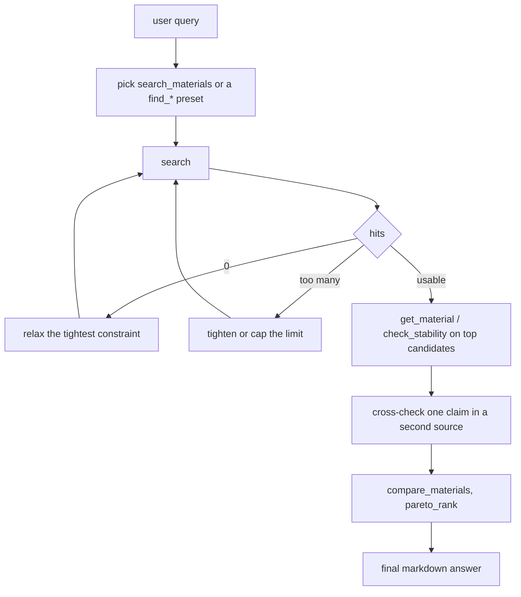

# Architecture

## One tool registry, three surfaces

- `tools/*.py` hold the logic. Typed args in, Pydantic models or dicts
  out. No branching by caller. This is the only layer that calls external
  APIs.
- `tool_facades.py` wraps each tool in flat kwargs (primitives and lists)
  and returns JSON-ready dicts. `ALL_TOOLS` lists the 25 exposed tools.
- `mcp_server.py` registers every entry of `ALL_TOOLS` with FastMCP. The
  facade docstring becomes the tool description.
- `web/app.py` mounts the same FastMCP instance at `/mcp/http/` and
  `/mcp/sse/`, so the stdio server, the remote MCP endpoint and the web
  agent expose one tool list.
- `agent/runner.py` does not hand tool schemas to OpenAI. It passes one
  `{type: "mcp", server_url: ...}` tool; OpenAI lists the tools over MCP
  and calls them back over HTTPS.

## Tools (25)

| Group | Tools | Source |
|---|---|---|
| Property lookup | `search_materials`, `get_material`, `compare_materials`, `check_stability` | Materials Project |
| Synthesis context | `get_phase_diagram`, `predict_decomposition`, `get_competing_phases`, `compute_phase_diagram_strict` | Materials Project, pymatgen |
| Application presets | `find_battery_anode`, `find_battery_cathode`, `find_solar_absorber`, `find_thermoelectric`, `find_transparent_conductor` | Materials Project |
| Property sheets | `get_elastic_properties`, `get_electronic_summary` | Materials Project |
| Ranking | `pareto_rank` | local |
| Structure export | `get_structure` (CIF, POSCAR, XYZ) | Materials Project |
| JARVIS-DFT | `find_2d_materials`, `get_jarvis_topological` | JARVIS via OPTIMADE (`find_2d_materials` only; `get_jarvis_topological` returns no data) |
| Federated search | `optimade_search` | 6 OPTIMADE providers: MP, COD, NOMAD, Alexandria, JARVIS, odbx |
| Experimental structures | `find_cod_experimental` | Crystallography Open Database |
| Literature | `get_doi_metadata`, `find_preprints`, `search_openalex`, `get_wikipedia_summary` | Crossref, arXiv, OpenAlex, Wikipedia |

`find_papers` and `get_papers_about` (Semantic Scholar) exist in
`tools/literature.py` but are not in `ALL_TOOLS`: the anonymous tier
rate-limits per IP.

## Web request flow

- **Polling, not SSE, to the browser.** DPI middleboxes on some networks
  cut long-lived `text/event-stream` responses. Short polls look like a
  normal REST API. The OpenAI to MCP hop is server-to-server and uses
  Streamable HTTP.
- **Two phases.** Discovery gets only candidate-finding tools and stops
  at a candidate list. Analysis gets drill-in tools (property sheets,
  stability, phase diagrams, `pareto_rank`, cross-source checks) and
  writes the final table. A single gpt-4o call used to stop after 5-7
  tool calls without an answer. The web agent allow-lists 23 of the 25
  tools. It leaves out the two JARVIS direct tools because NIST's static
  endpoints returned 502 in May 2026 and the agent kept calling them.
  Both tools now go through JARVIS OPTIMADE and add nothing over
  `optimade_search(providers=["jarvis"])`.
- **Follow-ups.** A conversation stores OpenAI's `last_response_id` and
  passes it as `previous_response_id` on the next turn.
- **Snapshots.** `web/app.py` saves each run (query, trace, answer,
  provenance) to `cache/research.db`. `/r/{id}` replays it. Resuming a snapshot rebuilds
  the messages into `input` items and runs one phase with all 25 tools,
  because the old response id has expired.
- **Limits.** One uvicorn worker, runs and conversations in memory, at
  most 8 concurrent runs (HTTP 429 above that), finished runs kept 10 min
  for late pollers, conversations 1 h.

## Self-correction

Self-correction is prompt-driven (`agent/prompts.py`), not a hardcoded
loop:

This loop is spelled out only in `SYSTEM_PROMPT_V1`, which resumed runs
use. The two-phase path uses the Discovery prompt, which says to retry a
first hit that is wrong for the application and to stop after 2-3
searches.

When the model retries a tool with wider or narrower args and wrote no
narration of its own, `_diff_for_adaptation` in `agent/runner.py` emits
an adaptation event (for example "Adapting: no stable hits, allowing
metastable phases this time.") so the trace shows why it retried.

## Cache

- Key = `sha256(tool_name + canonical_json(args))`. Argument order does
  not matter.
- TTL = `MATSCOUT_CACHE_TTL_DAYS` (default 30), checked on read.
- Location: `cache/matscout.db` under the project root. Never committed;
  a cold cache only makes the first calls slower.
- `compare_materials` and `check_stability` call `get_material` and add
  no cache entries of their own.

## Failure modes

| Failure | Behavior |
|---|---|
| `MP_API_KEY` missing | The stdio MCP server boots and the first tool call fails with a pydantic `ValidationError`. The web app, which hosts `/mcp/http/`, does not start: its startup check loads Settings, and `MP_API_KEY` is required. |
| `MP_API_KEY` empty | The MCP server and the web app start. Each tool call fails with a 401 from Materials Project. |
| `OPENAI_API_KEY` missing | The web app refuses to start. The MCP server and tools do not need it. |
| Unknown mp-id | `get_material` raises `MaterialNotFoundError`; the agent re-searches by composition. |
| Upstream source down (NIST, arXiv, ...) | The tool returns an "unavailable" payload or raises; the agent sees a `tool_error` and moves on to another source. |
| Model ends with no tool calls and under 250 characters of text | The text moves to the trace, and the final answer becomes a note asking to rerun. A no-tool answer of 250 characters or more is kept. |
| Model calls tools but writes no answer | The final answer lists the tools it called and points at the trace. |
| Responses API failed or incomplete | A `tool_error` event plus a short final message; the poller never hangs. |
| Too many concurrent runs | `POST /api/query` returns 429. |
| Unknown `Host` header on `/mcp/` | FastMCP rejects it; add the domain to `_ALLOWED_HOSTS` in `mcp_server.py`. |
